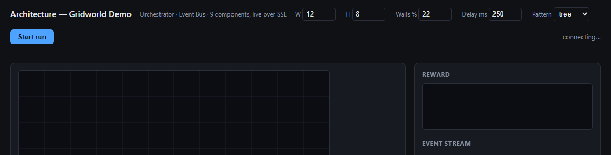
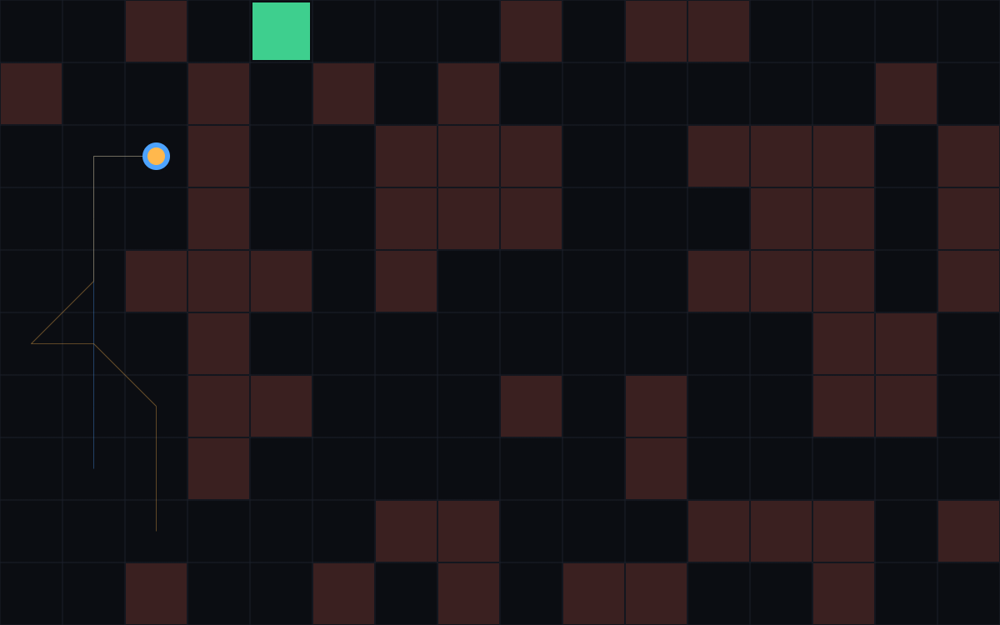
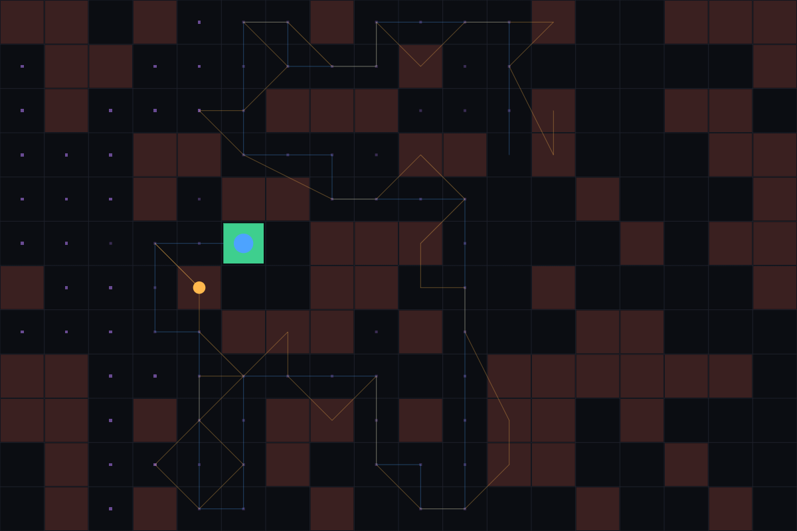
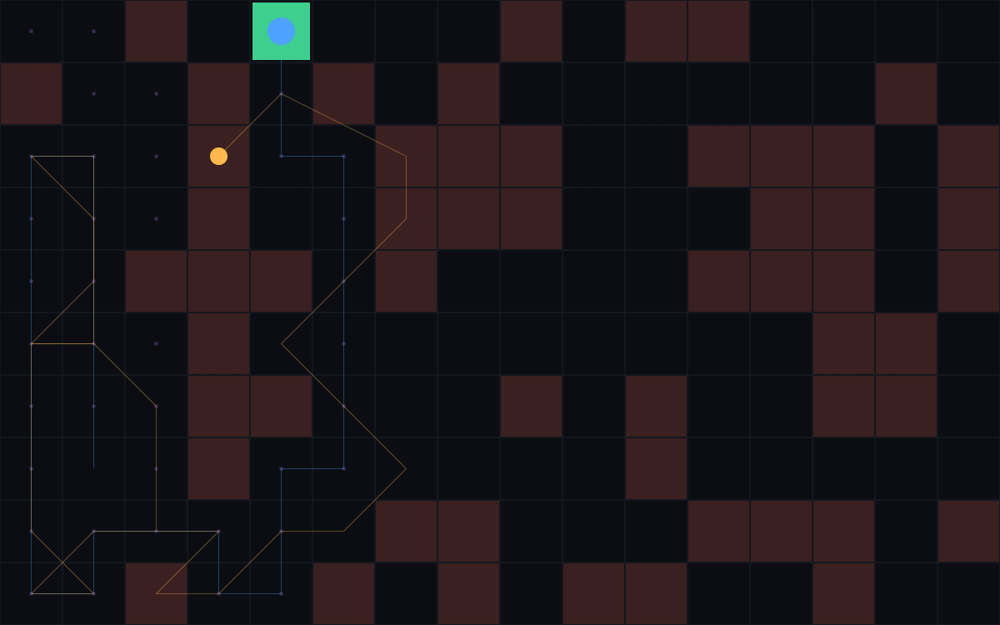

# POMDP-Simulation

A POMDP simulation built on Go, for validating, testing, and understanding
evolving decision-making patterns — similar to agentic environments. It is
a dependency-free Go SDK for building agents on the **Partially Observable
Markov Decision Process (POMDP)** model, plus a live, browser-based
gridworld demo that visualizes the belief-vs-truth gap and three distinct
navigation strategies (linear, tree, and graph search) in real time.

Prerequisite: a Go installation (1.26+).

## POMDP variables

Formally, a POMDP is the tuple **(S, A, T, Ω, O, R, γ, b₀)**. This SDK gives
each of those a concrete Go type or component, plus one addition
(**G**, the goal) that the classical model leaves implicit. The gridworld
demo column shows what each variable actually *is* in the shipped example.

| Symbol | Name | Description | SDK representation | Gridworld demo |
|---|---|---|---|---|
| **S** | State space | The true, possibly hidden set of states the environment can occupy. The agent never reads this directly. | `component.State{Seq, Time, Data}` — a versioned, timestamped snapshot held by the **State Ledger** | The agent's real `(X, Y)` cell, held in `Environment.true_` and mutated only by `Actuator.Execute` |
| **A** | Action space | The set of actions available to the agent at any point | `component.Action{Name, Params}`, enumerated by the **Action Registry** (`List()`/`Get()`) | `{up, down, left, right, stay}`, registered as `gridworld.Moves` |
| **T(s' \| s, a)** | Transition function | The (here, deterministic) probability of landing in state s′ after taking action a from state s | `TransitionEngine.Apply(ctx, current, action) → next` | Clamps the move to the grid and rejects it if the destination is a wall |
| **Ω** | Observation space | The set of signals the agent can perceive about the world | `component.Observation{Seq, Time, Data}`, appended to the **Observation Ledger** | A noisy `(X, Y)` reading, perturbed by up to `±Env.Noise` on each axis |
| **O(o \| s', a)** | Observation function | The probability of perceiving observation o given the resulting state s′ and action a | `ObservationGateway.Observe(ctx) → Observation` | `Environment.NoisyPosition()` — uniform noise in `[-Noise, +Noise]`, clamped to the grid |
| **b** | Belief state | The agent's running probability estimate over S, derived from the full observation history (what the agent *thinks* is true) | `component.Belief{Time, Data}`, produced by `BeliefEngine.Update(ctx, prior, obs)` | Exponential smoothing of noisy readings: `next = α·obs + (1-α)·prior`, rounded to the nearest cell |
| **R(s, a, s')** | Reward function | The feedback signal produced by a transition, used to judge action quality | `component.Reward{Time, Value, Info}`, produced by `RewardEvaluator.Evaluate(ctx, prev, action, next)` | `-1` per step, `+100` on reaching the goal; `Info` carries the remaining Manhattan distance |
| **γ** | Discount factor | How much future reward is worth relative to immediate reward, in the classical infinite-horizon formulation | *Not modeled.* This SDK targets episodic, goal-directed runs (reach the goal or exhaust the budget) rather than infinite-horizon return maximization — `Config.MaxSteps` caps the horizon instead of a discount | `MaxSteps: 500` in the demo server |
| **π** | Policy | The function mapping belief (and goal) to an action | `PolicyEngine.Decide(ctx, goal, belief) → Action` | Greedy: move one cell along whichever axis is furthest from the goal, based on belief |
| **G** *(SDK addition)* | Goal | What the Orchestrator is trying to achieve — not part of the classical tuple, but required to know when a POMDP *episode* ends | `component.Goal{ID, Data}` + `Config.IsGoalReached(State) bool` | `Goal.Data` is the target `(X, Y)`; reached when the *true* position equals it |

Two more fields exist purely as SDK bookkeeping, not classical POMDP
variables: the **Observation Ledger** (`ObservationLedger`) is the
durable, append-only log everything else can be rebuilt from, and the
**State Ledger** (`StateLedger`) is a fast, rebuildable materialized
projection of "current state" over that log — S itself is still owned by
the environment, not by either ledger.



## What is a POMDP, and what does this project simulate?

A POMDP models an agent that must act under uncertainty: it can never
directly see the true state of the world, only noisy or partial
**observations** of it. From that observation history it maintains a
**belief** — a running estimate of the true state — and picks **actions**
based on that belief rather than on ground truth. Each action changes the
real (hidden) state, and the agent receives a **reward** signal it uses to
judge how well it's doing.

This repository is a computational infrastructure for that loop, split into
two parts:

- **`sdk/`** — a framework-agnostic Go SDK. It defines nine small
  interfaces that together resolve the POMDP loop (sense → believe →
  decide → act → learn), an in-process event bus, and an Orchestrator that
  drives them according to a configurable navigation pattern.
- **`demo/`** — a runnable example: a 2D gridworld where an agent senses a
  noisy version of its position and must navigate to a hidden goal cell,
  plus a `net/http` server that streams every internal event to a browser
  dashboard over Server-Sent Events so you can *watch* belief converge to
  truth, and watch the planner search, backtrack, and commit to a path.

The included PDF, *["pomdp: A Computational Infrastructure for Partially
Observable Markov Decision Processes"](The%20R%20Journal_%20Pomdp_%20A%20Computational%20Infrastructure%20for%20Partially%20Observable%20Markov%20Decision%20Processes.pdf)*
(The R Journal), is kept as background reading on the formal POMDP model
this SDK is built to serve.

## Architecture: nine components, one event bus

Every run wires together nine small interfaces (`sdk/component/interfaces.go`),
each resolving exactly one part of the loop:

| Component | Resolves |
|---|---|
| **Observation Gateway** | The single ingress point between the environment and the system |
| **Observation Ledger** | Append-only, durable source of truth for everything ever observed |
| **Belief Engine** | Folds a new observation into the prior belief |
| **Policy Engine** | Selects the next action given the current belief and goal |
| **Action Registry** | What actions exist and are valid to select |
| **Transition Engine** | Predicts the next state given a state and an action |
| **State Ledger** | Fast, rebuildable access to the "current" materialized state |
| **Actuator Gateway** | The single egress point — carries out the selected action for real |
| **Reward Evaluator** | Scores a transition after it happens |

The `sdk/component/memory` package ships zero-dependency, in-memory
reference implementations of the storage-shaped components (Observation
Ledger, State Ledger, Action Registry); everything else is left for the
consumer to implement, so the core SDK never depends on a specific
environment, model, or backend. Every stage of every step publishes an
event onto an in-process `event.Bus` (`sdk/event/event.go`), which is how
the demo dashboard gets its live feed without polling.

## Scope of POMDP navigation: Linear, Tree, and Graph

The `Orchestrator` (`sdk/orchestrator/orchestrator.go`) owns the goal and
decides *how* to pursue it. This is the part of the architecture that
actually encodes "planning under partial observability," and it ships
three interchangeable patterns — set via `orchestrator.Config.Pattern`.
They share the same nine components and event bus; only the navigation
strategy differs.

To compare them fairly, the three screenshots below were captured on the
**same seeded maze** (16×10 grid, 30% wall density, same start/goal),
except where noted.

### 1. Linear — walk straight ahead, no re-navigation

`PatternLinear` asks the Policy Engine for one action per step and commits
it immediately. If a step fails (e.g. it walks into a wall), it retries
*that same step* up to `Config.MaxStepRetries` times — and nothing more.
It never revisits an earlier state and never tries a different route. This
is the cheapest pattern and the right choice when the environment is
simple or when re-planning cost isn't worth paying, but it has no recourse
against a dead end.



In this run, Linear greedily closes the distance to the goal (orange
trail) until it walks into a wall cluster it can't get around, retries
once, and aborts the run with `transition engine: gridworld: {3 2} is a
wall` — exactly the "no backtracking" behavior the pattern documents.

### 2. Tree — plan ahead with per-path backtracking

`PatternTree` never touches the real environment until it has already
found a full path to the goal. It performs a depth-first search purely
against the Transition Engine's *model* of the world: at each simulated
node it tries the next untried action, and whenever a branch dead-ends
(every action from that node is invalid or would immediately cycle back to
an ancestor on the *current* path), it backtracks to the previous node and
tries something else. Cycle detection is per-path only — the same state
can legally be re-explored by a different branch, which is what makes Tree
search more expensive than Graph on mazes with many alternate routes to
the same cell. Only once a complete path is found does it replay those
actions for real, one per step.



This example (a denser 18×12 maze, captured separately to show the effect
clearly) needed **698 simulated expansions and 650 backtracks** before it
found a 48-step path — every faint purple dot is a cell the planner
visited *in simulation only* while searching, long before the agent (blue)
ever moved for real.

### 3. Graph — plan ahead with global memoization

`PatternGraph` is the same depth-first search as Tree, but cycle detection
uses a **search-wide visited set** instead of a per-path one: once any
branch has explored a state, no other branch will ever explore it again.
This is plain DFS-with-memoization (not Dijkstra/A*, so it isn't
guaranteed shortest-path) — but on mazes where many branches would
otherwise re-discover the same cells, it converges dramatically faster
than Tree.



On the identical maze where Linear got stuck, Graph found a 30-step path
after only **39 explored nodes and 9 backtracks** — two orders of
magnitude less search than Tree needed on the denser maze above, precisely
because it never re-explores a state twice.

### Choosing a pattern

| | Real-world cost before acting | Backtracking | Revisits states? | Best for |
|---|---|---|---|---|
| **Linear** | None — acts every step | Same-step retry only | N/A | Simple/low-risk environments, tight step budgets |
| **Tree** | Full plan, simulated only | Per-path (DFS) | Yes, across branches | Environments where planning is cheap and paths rarely converge |
| **Graph** | Full plan, simulated only | Global (DFS + memoization) | No | Larger/denser environments where many paths reach the same states |

All planning-phase activity (`plan_started`, `plan_expanded`,
`plan_backtrack`, `plan_found`) is published as events before a single real
action is taken, and the Orchestrator never calls the Observation Gateway,
Belief Engine, or Actuator Gateway during planning — those model *sensing*
and *effecting* the real world, which a hypothetical lookahead should never
touch.

## Project structure

```
sdk/
  component/            nine core interfaces + shared types (Observation, Belief, Action, State, Reward, Goal)
  component/memory/      zero-dependency in-memory Action Registry, Observation Ledger, State Ledger
  event/                 in-process pub/sub event bus (Go channels, no external deps)
  orchestrator/          the Linear / Tree / Graph navigation patterns

demo/
  gridworld/              the simulated environment + reference implementations of all nine components
  server/                 net/http server: runs the orchestrator, streams events over SSE
  server/static/          the dashboard (plain HTML/JS/canvas, no build step)
```

## Running the demo

Requires Go 1.26+.

```bash
cd demo/server
go run .
```

Then open `http://localhost:8080`, pick a pattern (`linear`, `tree`, or
`graph`), a grid size, wall density, and step delay, and click **Start
run**. The canvas shows the goal (green), the agent's hidden true position
(blue), its belief estimate (orange), walls (dark red), and — for Tree and
Graph — every cell the planner explored in simulation (faint purple dots)
before it committed to a path.

## Extending the SDK

Every component is a small interface, so you can swap the in-memory
gridworld pieces for real implementations (a real sensor for the
Observation Gateway, a real actuator, a durable Observation Ledger backed
by an external log, etc.) without the core SDK ever depending on them.
The Orchestrator is the one piece designed to run single-process, since
distributing the navigation loop itself would need a coordination layer
this SDK deliberately doesn't take a position on.
